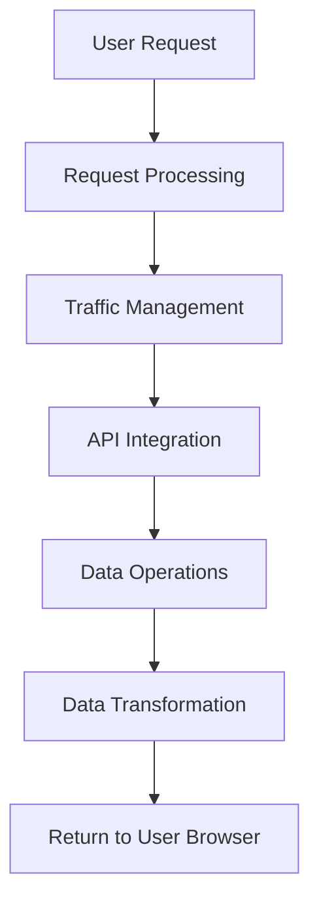

# 🐳 Set Up Kubernetes Deployment

<div align="center">

[](http://learn.nextwork.org/projects/aws-compute-eks2)

**Project Link:** [View Project on NextWork](http://learn.nextwork.org/projects/aws-compute-eks2)

---

**Author:** Ngurah Gede Wisnu Gudakesa  
📧 **Email:** ngurahgedewisnugk@gmail.com

</div>

---

## 📋 Table of Contents

- [Overview](#-overview)
- [Tools and Concepts](#️-tools-and-concepts)
- [Project Reflection](#-project-reflection)
- [What I'm Deploying](#-what-im-deploying)
- [Building a Container Image](#-building-a-container-image)
- [Container Registry](#-container-registry)
- [Extra: Backend Explained](#-extra-backend-explained)
- [Key Learnings](#-key-learnings)

---

## 🎯 Overview

In this project, I cloned the backend application code from GitHub, built a Docker image of the backend, and pushed that image to an **Amazon ECR repository**. This prepares the backend code for deployment with Kubernetes.

<div align="center">


</div>

---

## 🛠️ Tools and Concepts

### Technology Stack

| Tool | Purpose |
|------|---------|
| **Amazon EKS** | Managed Kubernetes service for container orchestration |
| **eksctl** | CLI tool to create and manage EKS clusters |
| **EC2** | Cloud compute instance to host the cluster |
| **Git** | Version control to clone application code |
| **Docker** | Platform to build container images |
| **Amazon ECR** | Container registry for storing Docker images |
| **GitHub** | Source code repository hosting |

### Workflow Overview
<div align="center">


</div>

---

## 💭 Project Reflection

### ⏱️ Time Investment
**Total Duration:** ~4 hours (including demo time)

### 🏆 Highlights

| Aspect | Details |
|--------|---------|
| **Most Challenging** | Diving deep into the backend code during the secret mission to understand its concepts and logic |
| **Most Satisfying** | Building the Kubernetes cluster using eksctl and creating container images |

### 📚 New Skills Acquired

1. ✅ Building a Docker image of the backend application
2. ✅ Pushing container images to Amazon ECR repository
3. ✅ Troubleshooting installation and configuration errors during the build process
4. ✅ Understanding backend code structure and logic for Kubernetes deployment

---

## 🚀 What I'm Deploying

### Setting Up the EKS Cluster

**Step-by-step process:** [reference here](<../01 - Launch a Kubernetes Cluster/01 - Launch a Kubernetes Cluster.md>)

1. 🖥️ Launched and connected to an EC2 instance
2. 📥 Installed the `eksctl` command-line tool
3. 🔐 Attached an IAM role with necessary permissions to EC2 instance
4. ⚙️ Created EKS cluster using `eksctl create cluster` command
5. ☁️ Amazon EKS handled complex setup via CloudFormation

### 🔧 Retrieving the Backend Code

**Steps taken:**

```bash
# Install Git on EC2 instance
sudo yum install git -y

# Configure Git with user details
git config --global user.name "Your Name"
git config --global user.email "your@email.com"

# Clone the repository
git clone https://github.com/nextwork/nextwork-flask-backend.git
```

> **What is a Backend?**  
> The backend is the server-side part of the application that handles:
> - 📊 Data processing
> - 🔄 User request handling
> - 💾 Database operations
> - 🔒 Business logic

<div align="center">


</div>

---

## 🐋 Building a Container Image

### Why Build a Container Image?

A container image packages the backend code, libraries, and settings into a **single, portable file**. This ensures:

- ✅ **Consistency:** Application runs identically across different environments
- 🔄 **Reproducibility:** Same behavior in development, testing, and production
- 📈 **Scalability:** Kubernetes can launch multiple identical containers
- 🚀 **Portability:** Easy deployment across different platforms

### 🐛 Troubleshooting: Permissions Error

#### The Problem
When attempting to build the Docker image, I encountered a permissions error:


**Root Cause:**  
Docker was installed for the root user, but I was operating as `ec2-user`. The `ec2-user` account didn't have permissions to run Docker commands.

#### The Solution

**Add user to Docker group:**

```bash
# Add ec2-user to the docker group
sudo usermod -aG docker ec2-user

# Refresh the session with reboot instances on AWS Console

# Verify Docker access
groups ec2-user
```

> **What is the Docker Group?**  
> The Docker group is a Linux system group that grants users permission to execute Docker commands without needing `sudo` every time.

<div align="center">


</div>

---

## 📦 Container Registry

### Why Amazon ECR?

**Amazon Elastic Container Registry (ECR)** is a fully managed container registry that makes it easy to store, manage, share, and deploy container images.

### 🎯 Benefits of Using ECR

| Benefit | Description |
|---------|-------------|
| 🔐 **Secure** | Private repositories with IAM-based access control |
| 🔗 **Integrated** | Seamless integration with EKS and other AWS services |
| ⚡ **Fast** | High-speed image transfers within AWS network |
| 📈 **Scalable** | Automatically scales to handle any number of images |
| 🔄 **Automated** | Supports CI/CD workflows and automated deployments |

### Why ECR for Kubernetes?

Container registries like Amazon ECR provide several advantages for Kubernetes deployments:

#### 🎯 Centralized Storage
- Single source of truth for all container images
- Ensures consistency across all environments

#### 🚀 Rapid Scaling
- Kubernetes pulls images on demand automatically
- All cluster nodes use the same, up-to-date images

#### 🔒 Security & Access Control
- Private repositories with resource-based permissions
- AWS IAM integration for fine-grained access control
- Secure access via CLI for users and EC2 instances

#### 🤖 Automation
- Supports automated workflows
- Eliminates manual image management on individual nodes
- Enables CI/CD pipelines

#### ⚡ Performance
- Minimal authentication setup with EKS
- Fast image pulls within AWS infrastructure

<div align="center">


</div>

---

## 🧠 Extra: Backend Explained

After reviewing the application's backend code, I learned that the backend acts as the **"brain" of the application**, responsible for:

### Backend Responsibilities



### 🎯 Core Functions

| Function | Description |
|----------|-------------|
| 🔄 **Request Processing** | Handles incoming user requests |
| 🚦 **Traffic Management** | Determines data routing and flow |
| 🔌 **API Integration** | Connects to external services and data sources |
| 💾 **Data Operations** | Stores and retrieves data from data sources |
| 📊 **Data Transformation** | Makes data human-readable (often as JSON) |

> 💡 **Important:** This backend code is precisely what gets packaged into the Docker image!

---

## 📄 Unpacking Three Key Backend Files

### 1. 📋 `requirements.txt`

This file lists all the dependencies the backend application needs:

| Dependency | Purpose |
|------------|---------|
| **Flask** | Python web framework for building the backend |
| **Flask-RESTx** | API extension allowing users/applications to make requests to the server |
| **Requests** | Library to fetch data from Hacker News API and handle authentication |
| **Werkzeug** | Helps Flask handle application-level routing to direct requests to the right function |

```python
#requirements.txt
Flask==2.1.3
Flask-RESTx==0.5.1
requests==2.28.1
Werkzeug==2.1.2
```

> 🎯 **Purpose:** Ensures all dependencies are installed when the container is built, providing a consistent and functional environment.

---

### 2. 🐳 `Dockerfile`

The Dockerfile acts as a **blueprint**, providing Docker with step-by-step instructions to build the container image.

**What it does:**

```dockerfile
# Example Dockerfile structure
FROM python:3.9-alpine

# adds author metadata to the image
LABEL Author="NextWork"

# Set working directory
WORKDIR /app

# Copy requirements and install dependencies
COPY requirements.txt requirements.txt
RUN pip install -r requirements.txt

# Copy application code
COPY . .

# Define startup command
CMD ["python", "app.py"]
```

**Key Steps:**

1. 📦 Specifies base image (Python runtime)
2. 📥 Installs necessary dependencies
3. 📁 Copies application code (Flask app)
4. ⚙️ Defines commands to run the application inside the container

---

### 3. 🐍 `app.py`


The main application file that sets up Flask and defines API routes.

**What it does:**


**Workflow:**

1. 📥 **Receives Request:** Extracts topic from URL
2. 🔍 **Queries API:** Searches Hacker News API for related content
3. 📊 **Processes Data:** Collects ID, title, and URL
4. 📤 **Returns Response:** Formats data as JSON

---

## 🎓 Key Learnings

### Technical Skills

| Skill | Achievement |
|-------|-------------|
| 🐳 **Docker Mastery** | Built and managed container images |
| ☁️ **AWS Services** | Worked with EKS, ECR, EC2, and IAM |
| 🔧 **CLI Tools** | Used eksctl, git, and docker commands |
| 🐛 **Troubleshooting** | Resolved permissions and configuration issues |
| 📚 **Code Understanding** | Analyzed backend architecture and logic |