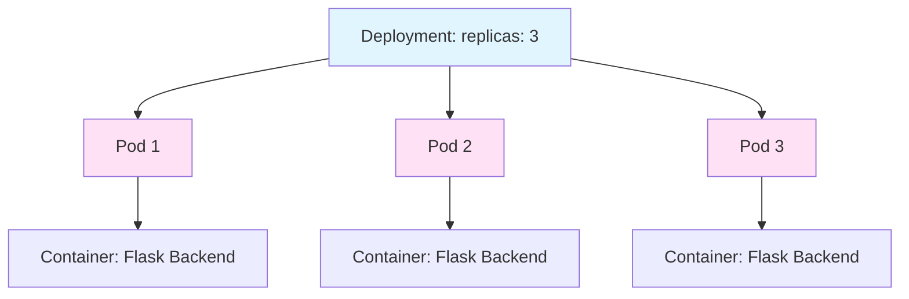

# 📝 Create Kubernetes Manifests

<div align="center">

[](http://learn.nextwork.org/projects/aws-compute-eks3)

**Project Link:** [View Project on NextWork](http://learn.nextwork.org/projects/aws-compute-eks3)

---

**Author:** Ngurah Gede Wisnu Gudakesa  
📧 **Email:** ngurahgedewisnugk@gmail.com

</div>

---

## 📋 Table of Contents
* [📝 Create Kubernetes Manifests](#-create-kubernetes-manifests)
* [📋 Table of Contents](#-table-of-contents)
* [🎯 Overview](#-overview)
* [🛠️ Tools and Concepts](#️-tools-and-concepts)
* [💭 Project Reflection](#-project-reflection)
* [Project Setup](#project-setup)
* [🚀 Deployment Manifest](#-deployment-manifest)
* [🌐 Service Manifest](#-service-manifest)
* [📦 The Power of Annotations Deployment Manifest](#-the-power-of-annotations-deployment-manifest)
* [🎓 Key Learnings](#-key-learnings)
* [Conceptual Understanding Architecture Overview](#conceptual-understanding-architecture-overview)

---

## 🎯 Overview

In this project, I created two essential **Kubernetes manifests**:

1. 📦 **Deployment Manifest** - Tells Kubernetes how to deploy my containerized backend
2. 🌐 **Service Manifest** - Exposes the application so users can access it

This makes the backend application **live and accessible** to users.

<div align="center">


</div>

---

## 🛠️ Tools and Concepts

### Technology Stack

| Technology | Purpose |
|------------|---------|
| **Amazon EKS** | Managed Kubernetes service |
| **eksctl** | Command-line tool for EKS cluster creation |
| **CloudFormation** | Infrastructure as Code (background automation) |
| **Amazon ECR** | Container registry for storing Docker images |
| **Docker** | Container image building and management |
| **Kubernetes Manifests** | YAML files defining desired application state |

### 📚 Key Concepts


> 💡 **Manifests = Blueprints**  
> Kubernetes manifests are configuration files that define the **desired state** of your application, which Kubernetes will automatically maintain.

---

## 💭 Project Reflection

### 🎓 Why This Project?

I chose this project because it directly aligns with my goal of transitioning into **Cloud Native Orchestration**, particularly with AWS. I'm enthusiastic about this area because:

- 📈 These skills are **highly in-demand**
- 🏗️ Builds foundational knowledge for Kubernetes
- ☁️ Essential for modern cloud infrastructure

### ⏱️ Time Investment

**Total Duration:** ~4 hours

### 🏆 Challenges & Highlights

| Aspect | Details |
|--------|---------|
| **Most Challenging** | Configuring and understanding replicas and pods - excited to apply these concepts in the next project! |
| **Most Satisfying** | Building a Kubernetes cluster using eksctl and container images |
| **Looking Forward** | Applying replica and pod concepts in real deployments |

---

## Project Setup

### 1️⃣ Kubernetes Cluster

**Setup Process:** [Read More](<../01 - Launch a Kubernetes Cluster/01 - Launch a Kubernetes Cluster.md>)

> ☁️ **Amazon EKS** handles complex setup tasks and integrates with other AWS services using CloudFormation behind the scenes.

---

### 2️⃣ Backend Code

The **backend** is the "brain" of the application,
- 🔄 Processing user requests
- 💾 Managing data operations
- 🔗 API integrations
- 📊 Business logic

**Setup Process:** [Read More](<../02 - Set Up Kubernetes Deployment/02 - Set Up Kubernetes Deployment.md>)

---

### 3️⃣ Container Image

#### Building the Image

```bash
# Build Docker image
docker build -t nextwork-flask-backend:latest .
```

**What This Does:**

| Step | Action |
|------|--------|
| 1️⃣ | Docker reads the **Dockerfile** |
| 2️⃣ | Packages application code + dependencies |
| 3️⃣ | Creates a **consistent, portable** container image |
| 4️⃣ | Ready for deployment across any environment |

**Setup Process:** [Read More](<../02 - Set Up Kubernetes Deployment/02 - Set Up Kubernetes Deployment.md>)

---

### 4️⃣ Pushing to Amazon ECR

**Why Amazon ECR?**

Amazon ECR provides:
- 🔐 Secure, private container registry
- 🤝 Minimal authentication setup with EKS
- ⚡ Fast image pulls within AWS
- 🔗 Seamless integration with AWS services

**Setup Process:** [Read More](<../02 - Set Up Kubernetes Deployment/02 - Set Up Kubernetes Deployment.md>)

## 📄 Manifest Files (START HERE)

### What Are Kubernetes Manifests?

Kubernetes manifests are **YAML configuration files** that act as blueprints, defining the desired state of your application.

](<assets/manifest directory.png>)

### 🎯 Why Use Manifests?

| Benefit | Description |
|---------|-------------|
| 📋 **Declarative** | Define "what" you want, not "how" to do it |
| 🔄 **Reproducible** | Same manifest = same deployment every time |
| 🤖 **Automated** | Kubernetes handles the implementation |
| 📊 **Version Control** | Track changes using Git |
| 🔧 **Maintainable** | Easy to update and modify |

## 🚀 Deployment Manifest 

A **Deployment manifest** tells Kubernetes:

- 🎯 Desired state of the backend application
- 📊 Number of replicas (copies) to run
- 📈 Scaling configuration
- 🔄 Update strategy
- 💻 Resource limits (CPU/memory)
- 🐳 Container image URL and configuration
- 🔌 Communication ports

<div align="center">


</div>

---

## 🌐 Service Manifest

### What is a Kubernetes Service?

A Kubernetes Service acts as a **traffic controller** that:

- 🚦 Directs incoming traffic to the correct pods
- 🌍 Exposes the application to users
- ⚖️ Provides load balancing
- 🔒 Abstracts internal pod details

### Why Do We Need a Service?

Without a Service, users would need to:
- ❌ Know the exact IP of each pod
- ❌ Handle pod restarts and IP changes
- ❌ Manually distribute traffic

With a Service:
- ✅ Single, stable endpoint
- ✅ Automatic traffic distribution
- ✅ Handles pod lifecycle changes

### My Service Manifest

<div align="center">


</div>

### How It Works

| Component | Purpose |
|-----------|---------|
| **Service Name** | `nextwork-flask-backend` - The service identifier |
| **Selector** | `app: nextwork-flask-backend` - Finds matching pods |
| **Port** | `8080` - External port users connect to |
| **Target Port** | `8080` - Internal port on pods |
| **Type** | `LoadBalancer` - Makes it accessible from outside |


---

## 📦 The Power of Annotations Deployment Manifest

**Annotating** my Deployment manifest helped by:

- 📝 Adding extra context and details
- 🧠 Improving understanding of architecture
- 👥 Making it clearer for team collaboration
- 📚 Providing insights into deployment purpose
- 🔧 Documenting specific configurations

](assets/metadata.png)

### Understanding Replicas and Pods

#### 🔑 Key Concept: Replicas

```yaml
spec:
  replicas: 3  # Creates 3 identical Pods under the node applications.
```

**What Does This Mean?**



- 3️⃣ **3 identical Pods** are created
- 🔄 Each Pod contains the same container image
- ⚖️ Work is distributed across all 3 Pods
- 🛡️ If one fails, others continue serving traffic

#### 🎯 What is a Pod?

A **Pod** is the smallest deployable unit in Kubernetes:

| Characteristic | Description |
|----------------|-------------|
| 🎁 **Bundle** | Group of one or more containers |
| 🌐 **Network** | Shared network namespace |
| 💾 **Storage** | Shared storage volumes |
| 🔗 **Communication** | Containers can talk via localhost |
| 🏠 **Co-location** | Always scheduled on the same node |

#### Why Multiple Replicas?

```yaml
replicas: 3
```

**Benefits:**

| Benefit | Explanation |
|---------|-------------|
| 🛡️ **High Availability** | App stays online if one pod fails |
| 📈 **Load Distribution** | Traffic spread across multiple pods |
| 🔄 **Rolling Updates** | Update pods one at a time without downtime |
| 💪 **Resilience** | Automatic recovery from failures |
| 📊 **Scalability** | Easy to increase/decrease capacity |


---

## 🎓 Key Learnings

<div align="center">


</div>

### Technical Skills Acquired

| Skill | What I Learned |
|-------|----------------|
| 📝 **Manifest Creation** | Writing Deployment and Service YAML files |
| 🎯 **Desired State** | Defining how applications should run |
| 🔄 **Replicas & Pods** | Understanding scaling and high availability |
| 🌐 **Service Exposure** | Making apps accessible to users |
| 📋 **Annotations** | Documenting configurations effectively |

## Conceptual Understanding Architecture Overview

](<assets/Architecture Overview.png>)

### 📚 Manifest Files Summary

### Deployment Manifest Purpose

| What It Defines | Example |
|-----------------|---------|
| 📦 Application Image | `image: ecr-url/backend:latest` |
| 🔢 Number of Replicas | `replicas: 3` |
| 💻 Resource Limits | `cpu: "500m", memory: "256Mi"` |
| 🔌 Container Ports | `containerPort: 8080` |
| 🏷️ Labels & Selectors | `app: nextwork-flask-backend` |
| 🌍 Environment Variables | `ENVIRONMENT: production` |

### Service Manifest Purpose

| What It Defines | Example |
|-----------------|---------|
| 🌐 Service Type | `type: LoadBalancer` |
| 🎯 Pod Selector | `app: nextwork-flask-backend` |
| 🔌 External Port | `port: 8080` |
| 📍 Target Port | `targetPort: 8080` |
| 🚦 Protocol | `protocol: TCP` |
