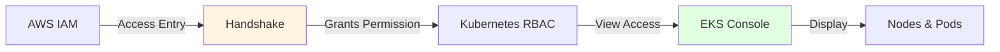
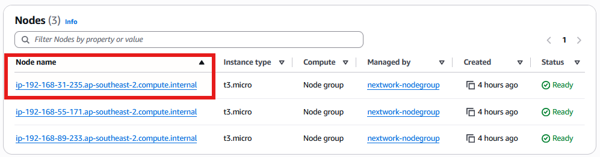
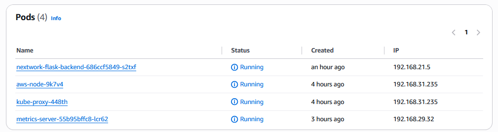

# 🚢 Deploy Backend with Kubernetes

<div align="center">

[](http://learn.nextwork.org/projects/aws-compute-eks4)

**Project Link:** [View Project on NextWork](http://learn.nextwork.org/projects/aws-compute-eks4)

---

**Author:** Ngurah Gede Wisnu Gudakesa  
📧 **Email:** ngurahgedewisnugk@gmail.com

</div>

---

## 📋 Table of Contents
* [🚢 Deploy Backend with Kubernetes](#-deploy-backend-with-kubernetes)
  * [📋 Table of Contents](#-table-of-contents)
  * [🎯 Overview](#-overview)
  * [🛠️ Tools and Concepts](#️-tools-and-concepts)
  * [💭 Project Reflection](#-project-reflection)
  * [🚀 Project Setup](#-project-setup)
  * [📄 Manifest Files](#-manifest-files)
  * [🚀 Backend Deployment (START HERE)](#-backend-deployment-start-here)
  * [✅ Verifying Deployment](#-verifying-deployment)
  * [🎓 Key Learnings](#-key-learnings)
  * [🎯 Best Practices Learned](#-best-practices-learned)

---

## 🎯 Overview

In this project, the main goal is to **deploy a backend application** to a Kubernetes cluster running on Amazon EKS. 

### Deployment Workflow


### Project Steps

1. 🏗️ **Setup** - Configure EKS cluster infrastructure
2. 📥 **Retrieve** - Pull backend code from GitHub
3. 🐳 **Build** - Create container image from code
4. 📦 **Store** - Push image to Amazon ECR
5. 📝 **Define** - Create Kubernetes manifests
6. 🚀 **Deploy** - Launch backend application on EKS

---

## 🛠️ Tools and Concepts

### Technology Stack

| Tool | Purpose |
|------|---------|
| 🖥️ **EC2** | Development environment and cluster nodes |
| ⚙️ **eksctl** | Setup and manage EKS cluster |
| 🔧 **Git** | Pull backend application code from GitHub |
| 🐳 **Docker** | Build container images |
| ☸️ **Kubernetes** | Container orchestration platform |
| 🎮 **kubectl** | Command-line tool to interact with Kubernetes |
| 📦 **Amazon ECR** | Container registry to store images |

### 🎯 Key Concept

> **Kubernetes Manifests = Blueprints**  
> Manifests are YAML files that act as blueprints for the EKS cluster to manage and deploy your application resources declaratively.

---

## 💭 Project Reflection

### ⏱️ Time Investment

**Total Duration:** ~7 hours

### 🏆 Challenges & Highlights

| Aspect | Details |
|--------|---------|
| **Most Challenging** | Deploying the backend with Kubernetes manifests - needed more time to fully grasp the deployment concept to an EKS cluster |
| **Most Satisfying** | Creating the EKS cluster and its resources using `eksctl` command, and building the container image with Docker |
| **Growth Area** | Understanding the relationship between manifests, pods, and deployments |

---

## 🚀 Project Setup

### 1️⃣ Kubernetes Cluster

**Setup Process:** [Read More](<../01 - Launch a Kubernetes Cluster/01 - Launch a Kubernetes Cluster.md>)

**Cluster Role:**

The cluster's primary role is to:
- 🚀 Deploy and manage containerized backend application
- ✅ Ensure code runs smoothly within the cluster environment
- 📈 Scale applications based on demand
- 🛡️ Provide high availability and fault tolerance

---

### 2️⃣ Backend Code

**Setup Process:** [Read More](<../02 - Set Up Kubernetes Deployment/02 - Set Up Kubernetes Deployment.md>)

**Why Pull the Code?**

 🧠 **Backend = Application Brain**  
 The backend code is essential because it contains the pre-built application that:
 - Processes user requests
 - Manages data operations
 - Handles business logic
 - Connects to databases and APIs

---

### 3️⃣ Container Image

**Setup Process:** [Read More](<../02 - Set Up Kubernetes Deployment/02 - Set Up Kubernetes Deployment.md>)

#### Why Build a Container Image?

Kubernetes needs a **blueprint** to deploy your application. A container image:

| Benefit | Description |
|---------|-------------|
| 📦 **Bundles Everything** | Packages all code and dependencies together |
| 🔄 **Consistency** | Creates multiple identical containers |
| 📈 **Scalability** | Easy to replicate for horizontal scaling |
| 🌍 **Portability** | Runs consistently across different environments |
| 🛡️ **Reliability** | Ensures predictable behavior |


### 4️⃣ Pushing to Container Registry

**Setup Process:** [Read More](<../02 - Set Up Kubernetes Deployment/02 - Set Up Kubernetes Deployment.md>)

**Why Amazon ECR?**

Pushing the container image to Amazon ECR facilitates scaling because:

**Benefits:**

- ⚡ **Fast Integration** - Excellent choice for EKS with minimal authentication
- 🔄 **Auto Updates** - Kubernetes pulls latest image on demand
- ✅ **Consistency** - Ensures consistent deployment across all nodes
- 🤖 **No Manual Work** - Automatic updates without manual intervention

---

## 📄 Manifest Files

**Setup Process:** [Read More](<../03 - Create Kubernetes Manifests/03 - Create Kubernetes Manifests.md>)

### What Are Kubernetes Manifests?

Kubernetes manifests are **YAML configuration files** that tell Kubernetes how to run and manage your application within a cluster.

### 🎯 What Manifests Define

```yaml
# Manifests specify:
- Which containers to run          # Container images
- How many copies (replicas)       # Scaling
- Traffic management               # Services & routing
- Resource allocation              # CPU & Memory limits
- Network configuration            # Ports & endpoints
```

**Benefits:**

| Benefit | Impact |
|---------|--------|
| 📋 **Declarative** | Define desired state, Kubernetes handles the rest |
| 🔄 **Reproducible** | Consistent deployments every time |
| 📊 **Simple Setup** | Makes complex configurations manageable |
| 🎯 **Maintainable** | Easy to update and version control |


### 🌐 Service Manifest

**Setup Process:** [Read More](<../03 - Create Kubernetes Manifests/03 - Create Kubernetes Manifests.md>)


**Service Manifest Defines:**

| Element | Function |
|---------|----------|
| 🎯 **Selector** | Which pods to target (using labels) |
| 🔌 **Port** | Service listening port |
| 📍 **Target Port** | Pod's container port |
| 🌍 **Node Port** | External access port (30000-32767) |
| 🚦 **Type** | NodePort makes it accessible from outside |

**With NodePort Type:**

- ✅ Backend app becomes accessible from outside the cluster
- ✅ Access via: `http://<node-ip>:30080`
- ✅ Traffic automatically load-balanced across pods


---

## 🚀 Backend Deployment (START HERE)

<div align="center">


</div>

### Deployment Command

```bash
# Navigate to manifests directory
cd ~/nextwork-flask-backend/manifests

# Apply Deployment manifest
kubectl apply -f flask-deployment.yaml

# Apply Service manifest
kubectl apply -f flask-service.yaml

# Verify deployment
kubectl get deployments
kubectl get services
kubectl get pods
```

**kubectl apply:**
- 📤 Sends YAML configurations to Kubernetes API
- 🎯 Tells Kubernetes to create resources based on manifest definitions
- ✅ Creates Deployment and Service objects in the cluster

---

### 🎮 kubectl vs eksctl

#### kubectl - The Supervisor

> **kubectl** is the command-line tool for interacting with Kubernetes resources once your cluster is running.

**What kubectl Does:**

| Command | Purpose |
|---------|---------|
| `kubectl apply` | Deploy/update resources |
| `kubectl get` | List resources |
| `kubectl describe` | Show detailed info |
| `kubectl logs` | View container logs |
| `kubectl delete` | Remove resources |
| `kubectl scale` | Adjust replicas |

**Example Usage:**

```bash
# Deploy application
kubectl apply -f deployment.yaml

# Check pods
kubectl get pods

# View logs
kubectl logs pod-name

# Scale deployment
kubectl scale deployment/backend --replicas=5
```

#### eksctl - The Cluster Manager

> **eksctl** is specifically for setting up and managing Amazon EKS clusters and associated AWS resources.

**What eksctl Does:**

| Command | Purpose |
|---------|---------|
| `eksctl create cluster` | Create new EKS cluster |
| `eksctl delete cluster` | Delete cluster |
| `eksctl create nodegroup` | Add node groups |
| `eksctl update cluster` | Update cluster config |

**Why Can't We Use eksctl for Deployment?**

| eksctl (Cluster & Infrastructure Manager) | kubectl (Kubernetes Resource Manager)  |
|---------|---------|
|✅ Create/delete clusters|✅ Deploy applications|
|✅ Manage node groups|✅ Manage deployments/services|
|✅ Configure AWS resources|✅ Control pods|
|❌ Deploy applications|✅ View logs and status|
❌ Manage pods/services|❌ Create clusters|   

**The Relationship:**

1. 🏗️ **eksctl** builds the house (cluster)
2. 🎮 **kubectl** manages what's inside (applications)

---

## ✅ Verifying Deployment

### Using the EKS Console

**Why Use EKS Console?**

The Amazon EKS console provides a **visual confirmation** that your backend application has successfully deployed to the cluster.

### Setting Up IAM Access Entry

**Required Step:**



**What It Does:**

The IAM access entry acts as a **"handshake"** between:
- 🔐 **AWS IAM** - Amazon's identity and access management
- ☸️ **Kubernetes RBAC** - Kubernetes role-based access control

**Result:**
- ✅ Grants your IAM user necessary permissions
- ✅ Allows you to view nodes in EKS console
- ✅ Enables verification of deployment status

---

### Understanding Pods

1. Once you gain access to your cluster's nodes
   
2. you'll discover **pods** running inside each node.
   


**Pod Characteristics:**

| Characteristic | Description |
|----------------|-------------|
| 🏗️ **Building Block** | Smallest deployable unit in Kubernetes |
| 📦 **Container Host** | Holds one or more containers that work together |
| 🌐 **Shared Network** | Containers in a pod share the same network space |
| 💾 **Shared Storage** | Containers can access the same volumes |
| 🔗 **Efficient Communication** | Containers communicate via localhost |
| 🎯 **Single IP** | Each pod gets one IP address |

**Why Pods?**

Pods allow containers to:
- 💬 Communicate easily (same network namespace)
- 📁 Share data (common storage volumes)
- 🤝 Work closely together
- 🔄 Be scheduled as a single unit

---

### Verification in EKS Console

**Steps to Verify:**

1. 🖥️ Navigate to Amazon EKS Console
2. 🔍 Select your cluster: `nextwork-eks-cluster`
3. 📊 Click on "Workloads" tab
4. 👁️ View running pods
5. 📝 Click on a pod to see details
6. ✅ Check the "Events" tab

**Events Tab Validation:**

From the **Events tab** of the backend pod, you can validate:

| Event | What It Means |
|-------|---------------|
| ✅ **Scheduled** | Pod assigned to a node successfully |
| ✅ **Pulling** | Container image being pulled from ECR |
| ✅ **Pulled** | Image successfully downloaded |
| ✅ **Created** | Container created in the pod |
| ✅ **Started** | Container is now running |

> ✅ **Success!**  
> These events confirm that the instructions from your deployment manifest were successfully executed by Kubernetes.

<div align="center">


</div>

---

## 🎓 Key Learnings

### Technical Skills Mastered

| Skill | Achievement |
|-------|-------------|
| 🚀 **Deployment** | Successfully deployed backend to Kubernetes |
| 🎮 **kubectl Mastery** | Applied manifests and managed resources |
| 🔍 **Verification** | Validated deployment using EKS console |
| 🏗️ **Infrastructure** | Understood pod and node architecture |
| 🔐 **Access Control** | Configured IAM access entries |

### Resource Overview

| Resource | Count | Purpose |
|----------|-------|---------|
| 🏗️ **EKS Cluster** | 1 | Container orchestration platform |
| 🖥️ **Nodes** | 3 | Worker machines running pods |
| 📦 **Pods** | 3 | Running backend containers |
| 🌐 **Service** | 1 | Exposing application externally |
| 🚀 **Deployment** | 1 | Managing pod replicas |
| 📷 **Container Images** | 1 | Application package in ECR |

---