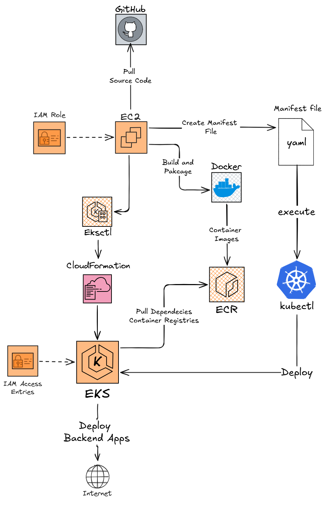

<div align="center">
  
  
# 🚀 Deploying an Containerized Flask Backend on Amazon EKS

[](https://aws.amazon.com/)
 
[](https://kubernetes.io/)
[](https://www.docker.com/)
[](https://flask.palletsprojects.com/)
 
 ---
  
  **Author:** Ngurah Gede Wisnu Gudakesa  
  **Email:** ngurahgedewisnugk@gmail.com
  
</div>

---

## 📋 Table of Contents

- [🎯 Introduction](#-introduction)
- [🏗️ Architecture Diagram](#️-architecture-diagram)
- [🛠️ Challange & Solutions](#-challenges--solutions)
- [🌐 Accessing the Backend](#-accessing-the-backend)
- [❓ Why This Project?](#-why-this-project)

---

# 🎯 Introduction

This project demonstrates the deployment of a **live, scalable Flask backend application** using **Amazon EKS (Elastic Kubernetes Service)**. The primary goal is to build a foundational understanding of Cloud Native Orchestration about containarized application from scratch to production-ready, Kubernetes-driven infrastructure.

---
### 🎓 Learning Objectives

- 📦 **Containerization** - Package Flask applications using Docker
- ☸️ **Orchestration** - Automate scaling and high availability with Kubernetes
- 🔒 **Security** - Configure IAM roles and Kubernetes RBAC
- 📊 **Monitoring** - Ensure application health and performance

---

# 🏗️ Architecture Diagram
<div align="center">
  
</div>

### 🔍 Architecture Breakdown : 

This architecture deploys a **production-ready Flask backend** on Amazon EKS with full containerization and Kubernetes orchestration.

### 📚 Core Components

| Component | Role | Description |
|-----------|------|-------------|
| **GitHub** | 📂 Source Control | Stores Flask application source code and Kubernetes manifests |
| **EC2 (Build Server)** | 🏭 Build & Deploy | Pulls code, creates YAML manifests, builds Docker images |
| **Docker & ECR** | 📦 Container Registry | Packages Flask app and stores images in AWS registry |
| **EKS Cluster** | ☸️ Orchestration | Manages containers, scaling, and high availability |
| **kubectl** | 🎮 Control Plane | Executes deployment commands to Kubernetes cluster |

### 🔧 Key Technologies

- **Backend Framework**: Flask (Python web framework)
- **Containerization**: Docker for packaging Flask application
- **Orchestration**: Kubernetes for managing containers at scale
- **Infrastructure as Code**: CloudFormation for automated EKS setup
- **Security**: IAM roles & IAM Access Entries for secure AWS service access

## 🎯 Outcome

A **live, production-ready Flask backend** running on EKS with:
- ✅ Automatic scaling based on traffic
- ✅ Load balancing across multiple nodes
- ✅ High availability with self-healing containers
- ✅ Consistent performance across environments

## 📖 Step-by-Step Build Guide

Follow this deployment journey through detailed documentation. Each step is documented separately for easy reference.

### 🛤️ Build Process

| Step | Topic | Description | Link |
|------|-------|-------------|------|
| **01** | **Launch a Kubernetes Cluster** | Setting up EC2 Instances, IAM Roles, and launch Kubernetes Cluster  through CloudFormation| [Read More](<01 - Launch a Kubernetes Cluster/01 - Launch a Kubernetes Cluster.md>) |
| **02** | **Set Up Kubernetes Deployment** | clone the backend application code from GitHub, build a Docker image of the backend, and then push that image to an Amazon ECR  repository | [Read More](<02 - Set Up Kubernetes Deployment/02 - Set Up Kubernetes Deployment.md>) |
| **03** | **Create Kubernetes Manifests** | create two Kubernetes manifests to deploy containerized backend apps and expose it |[Read More](<03 - Create Kubernetes Manifests/03 - Create Kubernetes Manifests.md>) |
| **04** | **Deploy Backend with Kubernetes** | deploy a backend application to a Kubernetes cluster running on Amazon EKS and  making it live and accessible to users|  [Read More](<04 - Deploy Backend with Kubernetes/04 - Deploy Backend with Kubernetes.md>)|
---

# 🛠 Challenges & Solutions

Building this environment required a combination of infrastructure-as-code and containerization tools. Below are the specific challenges encountered and their solutions:

<table>
  <thead>
    <tr>
      <th>🔧 Tool</th>
      <th>⚠️ Challenge</th>
      <th>✅ Solution</th>
    </tr>
  </thead>
  <tbody>
    <tr>
      <td><strong>eksctl</strong></td>
      <td>Command not found and initial execution errors</td>
      <td>Installed the <code>eksctl</code> CLI on the EC2 development instance</td>
    </tr>
    <tr>
      <td><strong>AWS IAM</strong></td>
      <td>EC2 instance lacked permissions to create EKS cluster</td>
      <td>Attached an IAM role with necessary permissions to the EC2 instance</td>
    </tr>
    <tr>
      <td><strong>Docker</strong></td>
      <td>Permission denied when running builds as standard user</td>
      <td>Added <code>ec2-user</code> to the <strong>Docker group</strong> to allow commands without <code>sudo</code></td>
    </tr>
    <tr>
      <td><strong>EKS Console</strong></td>
      <td>Nodes were not visible in AWS console after creation</td>
      <td>Created an <strong>IAM Access Entry</strong> with <code>AmazonEKSClusterAdmin</code> policy to link AWS IAM with Kubernetes RBAC</td>
    </tr>
  </tbody>
</table>

---

## ⚙️ Setup & Troubleshooting

If you are setting up this project for the first time, keep these troubleshooting tips in mind:

* **Verify Tooling**: Ensure `eksctl`, `kubectl`, `git`, and `docker` are all installed on your development EC2 instance before starting the cluster creation.


* **Authentication Handshake**: If your pods or nodes don't appear in the EKS Console, remember that AWS and Kubernetes use separate permission systems. You must explicitly map your IAM identity to the cluster's RBAC via an access entry.


* **State Management**: Kubernetes manifests act as the "source of truth" for your app. If your deployment fails, use `kubectl apply` to re-sync the desired state defined in your YAML files.

---

# 🌐 Accessing the Backend

Once the deployment is verified, access your application based on the Service type:

### Using NodePort

<div align="center">
  
</div>

### 🔗 Access URL
```
http://<EC2-Node-Public-IP>:<NodePort>
```

### 🔄 How It Works
The Service acts as a **traffic controller**, directing incoming traffic from the assigned NodePort to the pods labeled `app: nextwork-flask-backend` on `targetPort: 8080`.

### Expected JSON Output

<div align="center">
  
</div>

When you query the backend URL, the Flask application processes requests via the **Hacker News Search API** and returns a human-readable JSON response containing:
- 🆔 **ID** - Unique identifier
- 📰 **Title** - Content title
- 🔗 **URL** - Source link

### 📝 Example Response
```json
{
  "id": "12345",
  "title": "Example Article Title",
  "url": "https://example.com/article"
}
```
---

# ❓ Why This Project?

### 🔴 The Pain Point
Managing containers manually across multiple servers is a recipe for disaster. Without orchestration, if a container crashes at 3 AM, it **stays down** until a human intervenes. This leads to:
- 📉 Downtime and lost revenue
- 😰 Stressful on-call incidents
- 🐌 Slow response to traffic spikes

### 💚 The Solution
This project demonstrates **High Availability** and resilience through Kubernetes automation:

#### ✨ Key Benefits

| Feature | Benefit |
|---------|---------|
| 🔄 **Self-Healing** | Automatically restarts failed containers |
| 📈 **Auto-Scaling** | Scales from 1 to 3+ nodes based on traffic demand |
| 🎯 **Load Balancing** | Distributes traffic evenly across healthy pods |

